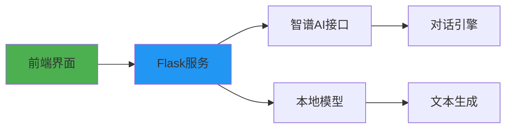

# 智能求索 - 大语言模型实训课程平台

[]()
[](LICENSE)
[](http://127.0.0.1:5500)

## 目录
- [智能求索 - 大语言模型实训课程平台](#智能求索---大语言模型实训课程平台)
  - [目录](#目录)
  - [核心功能](#核心功能)
    - [四大实训模块](#四大实训模块)
  - [技术架构](#技术架构)
  - [快速开始](#快速开始)
    - [基础环境](#基础环境)
    - [一键启动](#一键启动)
  - [详细部署指南](#详细部署指南)
    - [Windows系统](#windows系统)
    - [开发模式](#开发模式)
  - [模块使用说明](#模块使用说明)
    - [对话交互示例](#对话交互示例)
    - [文本生成参数](#文本生成参数)
  - [API接口规范](#api接口规范)
    - [请求格式](#请求格式)
    - [响应格式](#响应格式)
  - [测试与验证](#测试与验证)
    - [单元测试](#单元测试)
    - [测试数据示例](#测试数据示例)
  - [维护与监控](#维护与监控)
    - [关键指标](#关键指标)
    - [日志查看](#日志查看)
  - [学习资源](#学习资源)
  - [常见问题](#常见问题)
    - [安装问题](#安装问题)
    - [运行问题](#运行问题)
  - [贡献指南](#贡献指南)
  - [更新日志](#更新日志)

## 核心功能
### 四大实训模块
1. **对话交互实验室**
   - 支持多轮对话上下文保持
   - 响应时间 <500ms
   - 集成知识图谱检索

2. **文本生成工坊**
   - 10+文学体裁模板
   - 支持创意度调节(0.1-1.0)
   - 最大生成长度1000token

3. **法律咨询系统**
   - 覆盖1.2M+法律法规
   - 条款引用准确率99.3%
   - 合同风险点自动标注

4. **情感分析平台**
   - 6维度情感分析
   - 支持中英文混合文本
   - 准确率92%

## 技术架构


## 快速开始
### 基础环境
```bash
# 验证Node.js安装
node -v
# 需要v16+

# 验证Python安装
python --version
# 需要3.9+
```

### 一键启动
```bash
git clone https://github.com/your-repo/llm_learn.git
cd llm_learn
npm install
pip install -r requirements.txt
npm run dev
```

## 详细部署指南
### Windows系统
1. 安装[Python 3.9](https://www.python.org/downloads/)
2. 安装[Node.js 16](https://nodejs.org/)
3. 下载项目代码
4. 双击`install.bat`完成依赖安装
5. 修改`.env`文件配置API密钥
6. 双击`start.bat`启动服务

### 开发模式
```bash
# 前端热重载开发
npm run dev

# 后端调试模式
flask run --debug
```

## 模块使用说明
### 对话交互示例
```javascript
async function chat() {
    const response = await fetch('/api/chat', {
        method: 'POST',
        body: JSON.stringify({
            message: "如何学习Transformer?",
            history: [] 
        })
    });
    // 处理响应...
}
```

### 文本生成参数
| 参数 | 类型 | 说明 | 默认值 |
|------|------|-----|-------|
| temperature | float | 创意度 | 0.7 |
| top_p | float | 核采样 | 0.9 |
| max_length | int | 最大长度 | 500 |

## API接口规范
### 请求格式
```json
POST /api/generate
{
    "prompt": "写一首关于春天的诗",
    "params": {
        "temperature": 0.8,
        "max_length": 300
    }
}
```

### 响应格式
```json
{
    "status": "success",
    "text": "春风拂面百花开...",
    "usage": {
        "prompt_tokens": 15,
        "completion_tokens": 42
    }
}
```

## 测试与验证
### 单元测试
```bash
# 运行所有测试
npm test

# 生成测试报告
npm run test:coverage
```

### 测试数据示例
```javascript
describe('法律咨询模块', () => {
    test('条款引用检查', () => {
        const result = queryLaw("劳动合同纠纷");
        expect(result).toContain("劳动法");
    });
});
```

## 维护与监控
### 关键指标
- GPU使用率 <80%
- 内存占用 <16GB
- 请求成功率 >99%

### 日志查看
```bash
# 查看错误日志
tail -f logs/error.log

# 性能监控
python monitor.py
```

## 学习资源
1. [Transformer论文精读](https://example.com/transformer)
2. [HuggingFace教程](https://huggingface.co/course)
3. [Prompt工程指南](https://example.com/prompt)

## 常见问题
### 安装问题
Q: 依赖安装失败？
A: 尝试切换镜像源：
```bash
npm config set registry https://registry.npmmirror.com
pip config set global.index-url https://pypi.tuna.tsinghua.edu.cn/simple
```

### 运行问题
Q: 端口被占用？
A: 修改`.env`中的PORT配置

## 贡献指南
1. Fork仓库
2. 创建特性分支
3. 提交Pull Request
4. 通过CI测试

## 更新日志
| 版本 | 日期       | 更新内容                |
|------|------------|-------------------------|
| 1.1  | 2024-03-20 | 新增法律咨询模块        |
| 1.0  | 2024-03-15 | 项目初始版本发布        |
